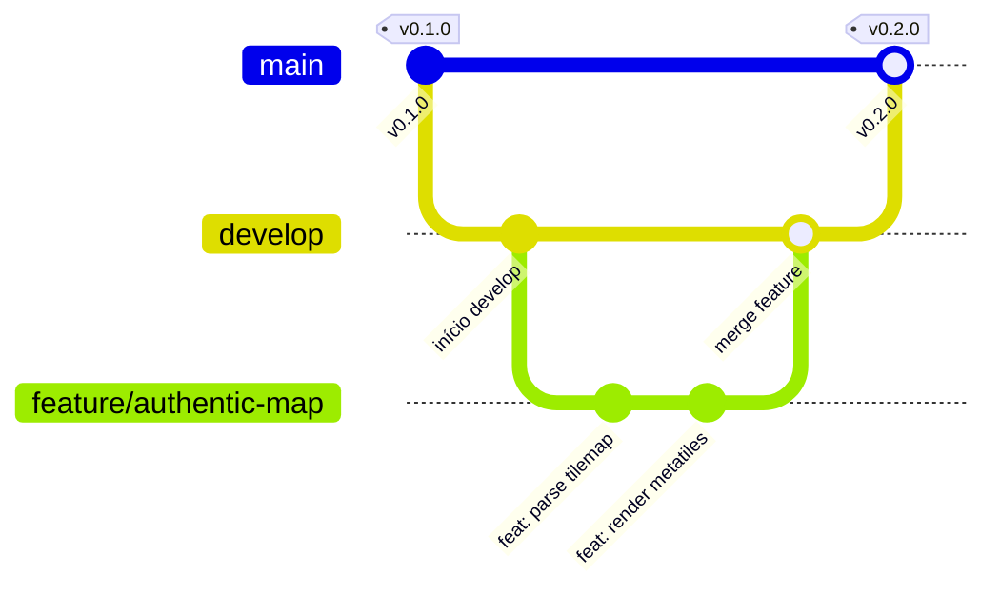

# Guia de Contribuição e Git Flow - OpenMinish 🍃

Obrigado pelo interesse em contribuir com o **OpenMinish**! Este documento orienta como estruturamos o desenvolvimento, ramificações de código (Git Flow), padronização de commits e conformidade legal.

---

## 🌿 1. Modelo de Ramificação: Git Flow

Adotamos formalmente o modelo **Git Flow** para organizar o ciclo de vida do projeto:



### 1.1 Branches Principais (Permanentes)

*   **`main`**: Contém exclusivamente código estável de produção. Cada atualização na `main` corresponde a uma nova versão com tag oficial (ex: `v0.1.0`, `v0.2.0`). **Nunca faça commits diretos na `main`**.
*   **`develop`**: Ramo principal de integração. É aqui que novas funcionalidades convergem e onde os testes de pré-lançamento são consolidados. É o branch padrão para criar novas features.

### 1.2 Branches de Suporte (Temporários)

*   **`feature/<nome-da-feature>`**:
    *   Criado sempre a partir de: `develop`
    *   Retorna para: `develop`
    *   Convenção de nomes: `feature/mapa-minish-woods`, `feature/hud-gba-classic`, `feature/bgm-midi-synth`
*   **`release/<versao>`**:
    *   Criado a partir de: `develop`
    *   Retorna para: `main` (com tag) e `develop`
    *   Usado para congelamento de código, polimento de documentação e ajustes finais.
*   **`hotfix/<nome-do-fix>`**:
    *   Criado a partir de: `main`
    *   Retorna para: `main` (com nova tag patch) e `develop`
    *   Reservado para correção de bugs críticos em releases publicadas.

---

## 🛠️ 2. Passo a Passo para Desenvolver uma Nova Feature

### Passo 1: Atualizar o branch `develop`
```bash
git checkout develop
git pull origin develop
```

### Passo 2: Criar o branch da feature
```bash
git checkout -b feature/nome-da-funcionalidade
```

### Passo 3: Implementar e commitar com Conventional Commits
Siga o padrão de commits semânticos:
- `feat:` Nova funcionalidade para o usuário ou engine
- `fix:` Correção de bug
- `docs:` Alterações em documentação ou comentários
- `refactor:` Refatoração de código sem alterar comportamento externo
- `perf:` Melhoria de performance

Exemplo:
```bash
git commit -m "feat(map): implementar decodificador de metatiles 16x16 da ROM"
```

### Passo 4: Mesclar de volta na `develop`
Após finalizar e testar a funcionalidade:
```bash
git checkout develop
git pull origin develop
git merge --no-ff feature/nome-da-funcionalidade
git push origin develop
```

E remover o branch local e remoto da feature se não for mais necessário:
```bash
git branch -d feature/nome-da-funcionalidade
```

---

## ⚖️ 3. Regra de Ouro: Zero-ROM

*   **NUNCA** commite arquivos `.gba`, dumps de ROM, ou assets brutos extraídos com direitos autorais.
*   O arquivo `.gitignore` já está configurado para proteger `ROMS/`, `build/` e `assets/regions/`.
*   Toda extração deve continuar sendo feita AOT via `asset_extractor.exe`.
