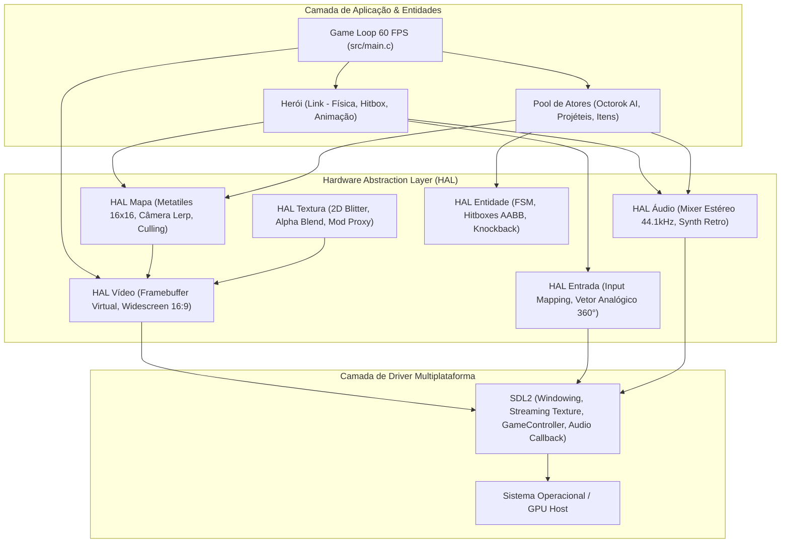

# OpenMinish 🍃

> **Port Nativo Multiplataforma (Windows, macOS, Linux) de *The Legend of Zelda: The Minish Cap* em C11, CMake e SDL2.**

[](https://en.wikipedia.org/wiki/C11_(C_standard_revision))
[](https://cmake.org/)
[](https://www.libsdl.org/)
[](#-princípio-de-distribuição-zero-rom)
[](#-como-compilar-e-executar)

---

## 📖 1. Visão Geral, Propósito Acadêmico & Desenvolvimento com IA

O **OpenMinish** é um projeto de estudo universitário e pesquisa técnica focado em **Engenharia de Software, Arquitetura de Motores de Jogos e Sistemas de Baixo Nível**. Seu objetivo central é estudar como reconstruir a arquitetura técnica de um clássico do Game Boy Advance (*The Legend of Zelda: The Minish Cap*, Capcom/Nintendo, 2004) como um **aplicativo nativo cross-platform em C moderno**.

> [!NOTE]
> **🤖 Transparência sobre o Uso de Inteligência Artificial (AI Pair Programming)**:
> Este projeto adota uma abordagem pioneira de **Programação em Par Humano-IA (Human-AI Pair Programming)**. O desenvolvimento é conduzido com o suporte de Inteligência Artificial avançada como assistente e mentor técnico para:
> - Arquitetura e modelagem de camadas HAL (Hardware Abstraction Layer).
> - Dedução de algoritmos de baixo nível (descompressão LZ77 do BIOS do GBA, conversão de espaços de cores BGR555 $\to$ RGBA8888).
> - Cinemática vetorial (física de aceleração 360° e deadzones euclidianas).
> - Síntese sonora procedural de ondas sonoras retro em C puro.
> - O projeto serve também como estudo de caso prático sobre como IAs podem acelerar a engenharia reversa para interoperabilidade e a educação em ciências da computação.

---

## ⚖️ 2. Princípio de Distribuição Zero-ROM (Clean-Room)

> [!IMPORTANT]
> **Conformidade Legal Estrita**:
> Este repositório **NÃO contém nenhuma ROM, binário proprietário ou arte gráfica protegida por direitos autorais**.
> 
> O pipeline foi projetado seguindo a filosofia *Clean-Room*:
> 1. Uma ferramenta auxiliar de linha de comando (`asset_extractor`) é compilada junto ao projeto.
> 2. O usuário utiliza sua própria cópia legal do jogo para extrair os gráficos.
> 3. O extrator descompacta a VRAM usando a rotina **LZ77 (SWI 0x11 do BIOS do GBA)** e gera os mapas de cores **RGBA8888** abertos.
> 4. Uma vez extraídos os assets em formato aberto, o jogo roda de forma 100% autônoma e independente de ROMs.

---

## 🌟 3. Principais Recursos Implementados

### 🎮 Suporte Analógico 360° Real com Cinemática Proporcional
- **Deadzone Circular Euclidiana** ($r = \sqrt{x^2 + y^2}$) com calibração precisa para anular *drifts* de sensores hall modernos.
- **Aceleração Dinâmica**: Link caminha na ponta dos pés (*tiptoe*) ao empurrar levemente a alavanca analógica e atinge corrida máxima com passos dinâmicos dependentes da velocidade.
- Suporte nativo ao controle **8BitDo Ultimate 2 Wireless**, Xbox Series/One, DualShock/DualSense e Nintendo Switch Pro Controller via SDL2 GameController API.

### 🖥️ Widescreen Nativo 16:9 com Frustum Culling
- Resolução base GBA: $240 \times 160$ pixels ($4:3$).
- **Modo Widescreen Nativo**: Expande o campo de visão para $284 \times 160$ pixels ($16:9$), revelando **44 pixels a mais de cenário real** horizontalmente sem esticar os sprites.
- **Câmera Virtual com Suavização Exponencial (Lerp)** a 12% por frame com *clamping* nos limites do mundo.
- **Frustum Culling Inteligente**: Reduz o custo de renderização do mapa em mais de 80%, desenhando apenas os blocos que cruzam o retângulo do visor da câmera.

### 🎵 Mixer de Áudio de Baixa Latência, Síntese Procedural & Motor BGM Chiptune
- Pipeline estéreo 44.1kHz 16-bit com buffer diminuto de 512 amostras ($\approx 11.6\text{ ms}$ de latência).
- Mixer multicanal *thread-safe* com até 16 vozes simultâneas e saturação anti-clipping.
- Sintetizador procedural emulando os chips sonoros clássicos (PSG e DirectSound):
  - Lâmina de espada, impacto metálico, passos alternados L/R com pitch orgânico, rolamento e o lendário **Chime de Segredo Zelda de 8 notas** ($\text{G5} \to \text{F\#5} \to \text{D\#5} \to \text{A4} \to \text{G\#4} \to \text{E5} \to \text{G\#5} \to \text{C6}$).
- **Motor de Trilha Sonora Chiptune Polifônico (GBA 4-Canais Emulados)**:
  - **Minish Woods ("Deepwood")**: 16 compassos em tempo 3/4 a 100 BPM com melodia etérea em flauta/ocarina com vibrato, harpa feérica arpejada em semicolcheias com eco estéreo ping-pong, baixo triangular suave e percussão de folhagens.
  - **Hyrule Overworld ("Hyrule Field Theme")**: 12 compassos em marcha marcial 4/4 a 144 BPM com fanfarra de trompetes heroicos em onda pulso 50%, harmonias staccato em onda pulso 25%, baixo acústico caminhante e caixa marcial com pratos de condução.
  - **Suporte Transparente a Mods de Áudio**: O motor checa primeiro se há arquivos `.wav` customizados em `assets/audio/` (ex: `minish_woods.wav`, `hyrule_overworld.wav`), permitindo que a comunidade adicione trilhas orquestradas completas sem alterar uma única linha de código C!
  - **Zero-Glitch Phase Alignment**: Loops pré-renderizados garantem continuidade exata da fase de onda e zero estalos na transição.
  - **Indicador Visual no HUD**: Ícone de nota musical/alto-falante com cores dinâmicas (Turquesa para Minish Woods, Dourado para Hyrule Overworld e Cinza para Mudo).

### 🗣️ NPCs, Sistema de Diálogos & Ezlo (Companheiro Gorro Falante)
- **Motor de Tipografia Bitmap Retrô 8x8**:
  - Renderização em software de fonte pixel art autônoma com espaçamento proporcional e sombra projetada em tempo real para alta legibilidade.
  - Suporte transparente a caracteres acentuados da língua portuguesa (`á`, `é`, `í`, `ó`, `ú`, `ç`, `ã`, `õ`, etc.) e glifos especiais Zelda (Coração, Rupee, Seta de Diálogo).
- **Balão de Diálogo Clássico do Minish Cap**:
  - Fundo esmeralda translúcido com *alpha blending*, moldura com detalhes em ouro/bronze, cantos ornamentais e badge com o nome do orador.
  - **Retratos Animados 32x32 (Portraits)**:
    - **Ezlo**: O pássaro-gorro icônico com crista vermelha, olhos expressivos (que piscam em repouso) e animação de bico falando.
    - **Forest Minish**: Habitante Picori fofo com gorro vermelho de semente com pom-pom, orelhas pontudas e túnica azul.
  - **Efeito Typewriter com Chirp Sintetizado**: Avanço progressivo de caracteres a 30 cps acompanhado de chirp retrô com micro-variação de pitch; aceleração com botão [B] e avanço/fechamento instantâneo com [A].
  - **Indicador de Próxima Página**: Seta animada saltitante (`▼`) informando espera por confirmação do jogador.
- **Interação com NPCs e Dicas do Ezlo**:
  - Habitante Minish interativo na clareira com prompt flutuante contextual `[A] Falar`.
  - Sistema de orientação ao pressionar `[E]` ou `[SELECT]`, onde Ezlo sai do gorro e oferece dicas dinâmicas sobre controles, combate e segredos da floresta.
  - **Pausa de Cena Canônica**: O tempo, a movimentação do herói e as IAs dos monstros congelam durante o diálogo para leitura tranquila.

### ⚔️ Pool de Atores Estático, IA de Inimigos & Sistema de Combate
- **Zero alocações dinâmicas no loop principal**: Todas as entidades operam sob um pool estático (`MAX_ENTITIES 32`), prevenindo quedas de frame e fragmentação de RAM.
- **Red Octorok (Máquina de Estados Finitos)**:
  - Patrulha e navegação autônoma pelo terreno florestal.
  - Detecção visual e antecipação com inchaço de bochechas por 22 frames.
  - Disparo de projéteis de pedras em velocidade balística com deflexão em pleno voo pela espada do herói.
  - Knockback físico com inércia, danos e drops aleatórios de **Rupees Verdes** (+5) e **Corações de Cura** (+1 HP).
- **Keese (Morcego Voador com Projeção de Sombra 3D)**:
  - Voo autêntico em altitude vertical $z$ com oscilação senoidal contínua de sustentação ($z = 10.0 + 3.5 \times \sin(t)$).
  - Projeção em tempo real de sombra oval no chão do terreno florestal, conferindo profundidade espacial isométrica.
  - IA preditiva com voo de cruzeiro, guincho de alerta, mergulho rasante em direção ao herói e recuo defensivo em arco.
  - Áudio procedural de rufal de asas e guincho de ecolocalização (`SOUND_KEESE_CHIRP`).
  - Abate aéreo sincronizado com a altitude da lâmina da espada.
- **Green ChuChu (Gosma Gelatinosa com Física de Squash & Stretch)**:
  - Camuflagem furtiva como poça de gosma verde no solo enquanto o herói está distante (imune a ataques na poça).
  - Efeito dinâmico de emergência vertical e deformação elástica (*squash & stretch*) ao detectar a aproximação de Link ($\le 65\text{px}$).
  - Salto parabólico no ar impulsionado com gravidade balística em direção ao alvo e som retrô de borracha (`SOUND_CHUCHU_SQUISH`).
  - Olhos esbugalhados cômicos, 2 pontos de vida com recuo elástico e explosão de gotas ao ser derrotado.

### 🪃 Armas Secundárias e Itens Clássicos (Bumerangue, Pote Mágico & Botas de Pegasus)
- **Bumerangue Mágico (Magic Boomerang)**:
  - Arremesso balístico com desaceleração gradual e **trajetória de retorno teleguiado** em curva contínua em direção a Link.
  - Rotação dinâmica em 4 ângulos com áudio de zunido aerodinâmico (`SOUND_BOOMERANG_FLY`).
  - Atordoa e fere monstros (Octoroks, Keese, ChuChus), corta arbustos e **captura itens distantes** (Rupees e Corações) trazendo-os até as mãos do herói ao som de chime de captura (`SOUND_ITEM_CATCH`).
- **Pote Mágico / Jarro de Vento (Gust Jar)**:
  - **Vórtice direcional contínuo de sucção** com linhas espirais de partículas de vento (`SOUND_GUST_SUCTION`).
  - Física de atração gravitacional: puxa monstros em direção ao bocal, desmascara ChuChus forçando-os para fora de suas poças, atrai itens caídos e **absorve projéteis de pedras** no ar.
  - **Rajada de Ar Pressurizada**: Ao soltar o botão de sucção, Link dispara um projétil de vento compacto em alta velocidade (`SOUND_GUST_BLAST`), rompendo arbustos e arremessando inimigos.
- **Botas de Pegasus (Pegasus Boots)**:
  - Arrancada veloz e veloz em linha reta com multiplicador de velocidade de corrida ($1.85\times$), permitindo cruzar grandes distâncias e atropelar obstáculos.
- **HUD Integrado de Subarmas**:
  - Slot ornamental do botão `[B]` no topo da tela com miniaturas pixel art dedicadas (Bumerangue dourado com gema rubi, Pote terracota e Bota alada de Pegasus).

### 🎨 Sprites Autênticos Extraídos da ROM (Clean-Room AOT)
- **Metatiles 1D do GBA**: Montagem canônica de metatiles 16x24 (3 fatias de 16x8) para o Link e metatiles 16x16 (4 tiles 8x8) para os Octoroks e projétil de pedra.
- **Canal Alfa & Espelhamento Horizontal (`flip_h`)**: Decodificação de transparência e espelhamento horizontal em tempo real para as direções simétricas (esquerda/direita).
- **Animações Completas**: Ciclo de caminhada direcional do Link com leve *bobbing*, golpe de espada, patrulha do Octorok, inchaço de bochechas para disparo e recuo com flicker ao sofrer dano.
- **Fallback Gracioso**: Se os assets não forem extraídos previamente, a engine entra automaticamente no modo geométrico procedural sem interromper a execução.

### 🌲 Cenário Autêntico: Minish Woods (Overworld 1008x1008)
- **Engenharia Reversa dos Mapas Canônicos**:
  - Descompressão LZ77 e montagem da estrutura `gMapData` do GBA (VRAM tiles, metatiles 16x16, paletas de área e índices de sala).
  - Renderização pixel-perfect do mapa completo de **Minish Woods** ($1008 \times 1008$ pixels, $63 \times 63$ blocos de cenário) com caminhos de terra, pontes de pedra, bordas florestais densas e o pátio do santuário.
  - **Matriz de Colisão Binária (`map_woods_collision.bin`)**: 3.969 células de colisão derivadas dos atributos de ladrilho canônicos (`types_bot`), bloqueando árvores, água profunda e limites do mundo enquanto permite navegação fluida em trilhas.
  - **Desempenho Zero-Overhead**: Blit ultra-otimizado de passagem única via hardware abstraction layer mantendo 60 FPS contínuos.

### 🌍 Suporte Multi-Região Dinâmico
- Troca a quente entre os bancos gráficos, mapas e localizações das regiões:
  - **USA** (`BZME`) - Inglês
  - **EUR** (`BZMP`) - Multi-5
  - **JPN** (`BZMJ`) - Japonês

---

## 🏗️ 4. Arquitetura da Solução



---

## 📁 5. Estrutura do Repositório

```
OpenMinish/
├── assets/
│   ├── lang/           # Arquivos de tradução (ex: pt_BR.json)
│   ├── regions/        # Pastas geradas pelo extrator (usa, eur, jpn)
│   └── textures/       # Pasta do Proxy de Mods (coloque BMPs HD aqui)
├── include/
│   ├── gba/
│   │   └── types.h     # Tipos canônicos de largura fixa (u8, u16, u32, s8...)
│   └── hal/
│       ├── audio.h     # API do mixer estéreo e síntese procedural
│       ├── dialogue.h  # API de caixas de diálogo, portraits e dicas do Ezlo
│       ├── entity.h    # API do pool de atores, IA do Octorok e combate
│       ├── font.h      # API do motor de tipografia bitmap retrô 8x8
│       ├── input.h     # API do sistema de entrada e vetor analógico 360°
│       ├── map.h       # API de tilemaps, câmera e frustum culling
│       ├── subweapon.h # API de armas secundárias (Bumerangue, Pote Mágico, Botas)
│       ├── texture.h   # API do blitter e proxy de texturas
│       └── video.h     # API do framebuffer virtual e widescreen
├── src/
│   ├── hal/
│   │   ├── audio.c     # Implementação do mixer PCM, síntese e BGM chiptune
│   │   ├── dialogue.c  # Sistema de diálogos, efeito typewriter e portraits
│   │   ├── entity.c    # Implementação da IA, projéteis e loot drops
│   │   ├── font.c      # Renderizador de glifos 8x8 e caracteres acentuados
│   │   ├── input.c     # Processamento de gamepad analógico e teclado
│   │   ├── map.c       # Renderização de metatiles e câmera Lerp
│   │   ├── subweapon.c # Físicas balísticas, retorno teleguiado e vórtices
│   │   ├── texture.c   # Carregador de BMPs e substituição de texturas HD
│   │   └── video.c     # Janela e textura de streaming SDL2
│   └── main.c          # Ponto de entrada, lógica de jogo e renderização
├── tools/
│   ├── extractor/      # Ferramenta AOT de descompressão LZ77 e conversão BGR555
│   └── probe_controller.c # Utilitário para diagnóstico de gamepads
├── .gitignore          # Proteção estrita contra ROMs e binários
└── CMakeLists.txt      # Script de compilação multiplataforma
```

---

## 🚀 6. Como Compilar e Executar

### Pré-requisitos
- Compilador C compatível com **C11** (GCC 14+, Clang 16+ ou MSVC 2022).
- **CMake** 3.20 ou superior.
- **Ninja** (ou Make).
- *(Opcional)* Conexão à internet na primeira compilação para o CMake baixar a SDL2 automaticamente via `FetchContent`.

### Passo 1: Clonar o Repositório
```bash
git clone https://github.com/SEU_USUARIO/OpenMinish.git
cd OpenMinish
```

### Passo 2: Configurar e Compilar
No Windows (PowerShell com MinGW / GCC):
```powershell
cmake -B build -G Ninja -DCMAKE_BUILD_TYPE=Release
cmake --build build
```

No Linux / macOS:
```bash
cmake -B build -G Ninja -DCMAKE_BUILD_TYPE=Release
cmake --build build
```

### Passo 3: Extrair os Gráficos da sua ROM
Copie sua ROM limpa (ex: `zelda_usa.gba`) e execute a ferramenta AOT de extração:
```bash
./build/asset_extractor ROMS/zelda_usa.gba
```

### Passo 4: Jogar!
```bash
./build/zelda_port
```

---

## 🎮 7. Mapa de Controles

| Ação | Teclado | Controle (8BitDo / Xbox) | Controle (PlayStation) |
| :--- | :--- | :--- | :--- |
| **Mover Link** | `W`, `A`, `S`, `D` ou Setas | Alavanca Analógica Esquerda | Alavanca Analógica Esquerda |
| **Atacar / Falar (NPCs)** | `Z` ou Barra de Espaço | **Botão A** | **Botão Cruz (X)** |
| **Item Secundário [B]** | `X` (Segurar/Soltar) | **Botão B** | **Botão Círculo (O)** |
| **Ciclar Subarmas** | `Q` | Gatilho `L` / `LB` | Gatilho `L1` |
| **Falar com Ezlo (Dicas)** | Tecla `E` | Botão `Select` / `Back` | Botão `Share` |
| **Trilha Sonora (BGM)** | `T` | Gatilho `R` / `RB` | Gatilho `R1` |
| **Segredo Zelda** | `M` | — | — |
| **Alarme de Vida** | `H` | — | — |
| **Alternar 16:9 Widescreen** | Tecla `W` | — | — |
| **Alternar Região** | `1` (USA) \| `2` (EUR) \| `3` (JPN) | — | — |
| **Sair do Jogo** | `ESC` | — | — |

---

## 🤝 8. Contribuições da Comunidade (Open Source)

O **OpenMinish** é um repositório aberto e colaborativo. Estudantes, desenvolvedores de jogos, entusiastas de emulação e a comunidade de preservação são encorajados a contribuir com melhorias, correções e novos recursos!

### Como Contribuir:
1. **Fork** o projeto.
2. Crie uma branch para sua feature (`git checkout -b feature/minha-melhoria`).
3. Faça o commit das suas mudanças com mensagens semânticas (`git commit -m 'feat: adiciona inimigo ChuChu verde'`).
4. Envie para o seu fork (`git push origin feature/minha-melhoria`).
5. Abra um **Pull Request**.

### Áreas Abertas para Contribuição:
- 👾 **Novas Entidades e Chefes**: Implementação de mais inimigos clássicos (Keese, Moblin, Spiny Beetle, Big Green ChuChu).
- 🗺️ **Masmorras e Eventos**: Parser de scripts de diálogos, cutscenes e transição de salas subterrâneas.
- 🎨 **Packs de Texturas HD**: Arte em alta resolução para ser carregada via `assets/textures/`.
- 🎼 **Trilha Sonora e Áudio**: Suporte a faixas de música orquestradas e formatos de streaming modernos.
- 📱 **Novos Alvos de Port**: Compilação para Raspberry Pi, Nintendo Switch Homebrew e WebAssembly (jogável no navegador).

> [!CAUTION]
> **Regra de Ouro**: Nenhum Pull Request contendo arquivos de ROM proprietários, assets extraídos protegidos por copyright ou binários compilados será aceito. Todo código deve ser C11 limpo, modular e aderente ao HAL.

---

## 📜 9. Declaração Legal e Isenção de Responsabilidade

*The Legend of Zelda* e *The Legend of Zelda: The Minish Cap* são marcas registradas e propriedades intelectuais da **Nintendo Co., Ltd.** e da **Capcom Co., Ltd.**. 

O projeto **OpenMinish** é um projeto de pesquisa acadêmica sem fins lucrativos, desenvolvido sob o amparo da doutrina de uso justo (*Fair Use*) para fins de ensino e engenharia reversa para interoperabilidade. Este projeto não possui afiliação, patrocínio ou endosso da Nintendo ou da Capcom.
