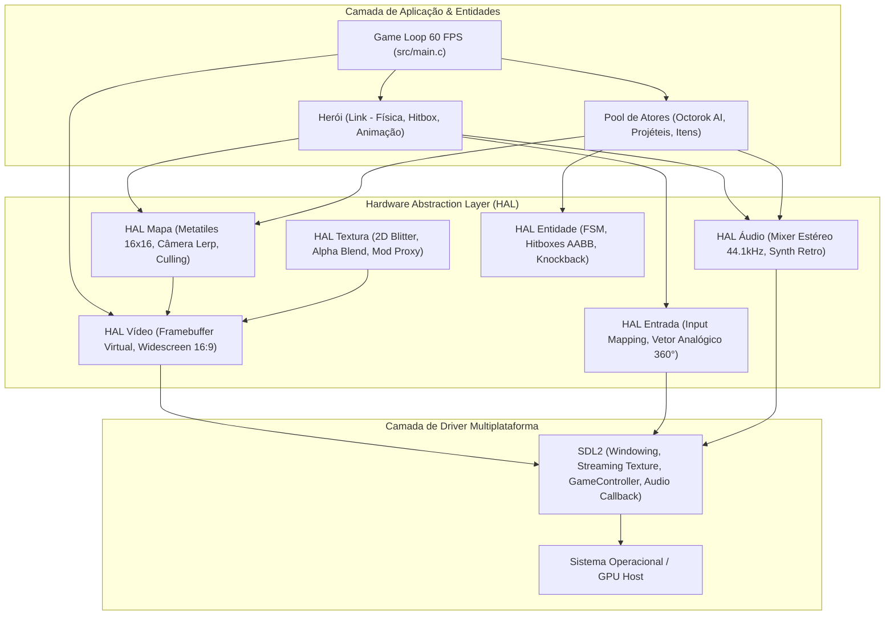

# OpenMinish 🍃

> **Port Nativo Multiplataforma (Windows, macOS, Linux) de *The Legend of Zelda: The Minish Cap* em C11, CMake e SDL2.**

[](https://en.wikipedia.org/wiki/C11_(C_standard_revision))
[](https://cmake.org/)
[](https://www.libsdl.org/)
[](#-princípio-de-distribuição-zero-rom)
[](#-como-compilar-e-executar)

---

## 📖 1. Visão Geral e Propósito Acadêmico

O **OpenMinish** é um projeto de estudo universitário de Engenharia de Software e Sistemas de Computação de Baixo Nível. Seu objetivo é reconstruir a arquitetura técnica de *The Legend of Zelda: The Minish Cap* (originalmente desenvolvido pela Capcom e lançado para Game Boy Advance em 2004) como um **aplicativo nativo cross-platform de alta performance**.

Diferente de um emulador (que interpreta o bytecode da CPU ARM7TDMI e simula registradores de hardware a cada ciclo), o **OpenMinish** compila o código-fonte C diretamente para as instruções nativas do processador do computador (x86_64 / ARM64), usufruindo da aceleração da GPU moderna, baixa latência de entrada e áudio, e resolução expansível.

---

## ⚖️ 2. Princípio de Distribuição Zero-ROM (Clean-Room)

> [!IMPORTANT]
> **Conformidade Legal Estrita**:
> Este repositório **NÃO contém nenhuma ROM, binário proprietário ou arte gráfica protegida por direitos autorais**.
> 
> O pipeline foi projetado seguindo a filosofia *Clean-Room*:
> 1. Uma ferramenta auxiliar de linha de comando (`asset_extractor`) é compilada junto ao projeto.
> 2. O usuário utiliza sua própria cópia legal do jogo para extrair os gráficos.
> 3. O extrator descompacta a VRAM usando a rotina **LZ77 (SWI 0x11 do BIOS do GBA)** e gera os mapas de cores **RGBA8888** abertos.
> 4. Uma vez extraídos os assets em formato aberto, o jogo roda de forma 100% autônoma e independente de ROMs.

---

## 🌟 3. Principais Recursos Implementados

### 🎮 Suporte Analógico 360° Real com Cinemática Proporcional
- **Deadzone Circular Euclidiana** ($r = \sqrt{x^2 + y^2}$) com calibração precisa para anular *drifts* de sensores hall modernos.
- **Aceleração Dinâmica**: Link caminha na ponta dos pés (*tiptoe*) ao empurrar levemente a alavanca analógica e atinge corrida máxima com passos dinâmicos dependentes da velocidade.
- Suporte nativo ao controle **8BitDo Ultimate 2 Wireless**, Xbox Series/One, DualShock/DualSense e Nintendo Switch Pro Controller via SDL2 GameController API.

### 🖥️ Widescreen Nativo 16:9 com Frustum Culling
- Resolução base GBA: $240 \times 160$ pixels ($4:3$).
- **Modo Widescreen Nativo**: Expande o campo de visão para $284 \times 160$ pixels ($16:9$), revelando **44 pixels a mais de cenário real** horizontalmente sem esticar os sprites.
- **Câmera Virtual com Suavização Exponencial (Lerp)** a 12% por frame com *clamping* nos limites do mundo.
- **Frustum Culling Inteligente**: Reduz o custo de renderização do mapa em mais de 80%, desenhando apenas os blocos que cruzam o retângulo do visor da câmera.

### 🎵 Mixer de Áudio de Baixa Latência & Síntese Procedural Retro
- Pipeline estéreo 44.1kHz 16-bit com buffer diminuto de 512 amostras ($\approx 11.6\text{ ms}$ de latência).
- Mixer multicanal *thread-safe* com até 16 vozes simultâneas e saturação anti-clipping.
- Sintetizador procedural emulando os chips sonoros clássicos (PSG e DirectSound):
  - Lâmina de espada, impacto metálico, passos alternados L/R com pitch orgânico, rolamento e o lendário **Chime de Segredo Zelda de 8 notas** ($\text{G5} \to \text{F\#5} \to \text{D\#5} \to \text{A4} \to \text{G\#4} \to \text{E5} \to \text{G\#5} \to \text{C6}$).

### ⚔️ Pool de Atores Estático & Sistema de Combate
- **Zero alocações dinâmicas no loop principal**: Todas as entidades operam sob um pool estático (`MAX_ENTITIES 32`), prevenindo quedas de frame e fragmentação de RAM.
- **IA do Red Octorok (Máquina de Estados Finitos)**:
  - Patrulha e navegação autônoma pelo terreno.
  - Detecção visual e antecipação com inchaço de bochechas por 22 frames.
  - Disparo de projéteis de pedras em velocidade balística.
  - Deflexão em pleno voo com a espada do Link.
  - Knockback físico com inércia, danos e drops aleatórios de **Rupees Verdes** (+5) e **Corações de Cura** (+1 HP).

### 🌍 Suporte Multi-Região Dinâmico
- Troca a quente entre os bancos gráficos e localizações das regiões:
  - **USA** (`BZME`) - Inglês
  - **EUR** (`BZMP`) - Multi-5
  - **JPN** (`BZMJ`) - Japonês

---

## 🏗️ 4. Arquitetura da Solução



---

## 📁 5. Estrutura do Repositório

```
OpenMinish/
├── assets/
│   ├── lang/           # Arquivos de tradução (ex: pt_BR.json)
│   ├── regions/        # Pastas geradas pelo extrator (usa, eur, jpn)
│   └── textures/       # Pasta do Proxy de Mods (coloque BMPs HD aqui)
├── include/
│   ├── gba/
│   │   └── types.h     # Tipos canônicos de largura fixa (u8, u16, u32, s8...)
│   └── hal/
│       ├── audio.h     # API do mixer estéreo e síntese procedural
│       ├── entity.h    # API do pool de atores, IA do Octorok e combate
│       ├── input.h     # API do sistema de entrada e vetor analógico 360°
│       ├── map.h       # API de tilemaps, câmera e frustum culling
│       ├── texture.h   # API do blitter e proxy de texturas
│       └── video.h     # API do framebuffer virtual e widescreen
├── src/
│   ├── hal/
│   │   ├── audio.c     # Implementação do mixer PCM e efeitos sonoros
│   │   ├── entity.c    # Implementação da IA, projéteis e loot drops
│   │   ├── input.c     # Processamento de gamepad analógico e teclado
│   │   ├── map.c       # Renderização de metatiles e câmera Lerp
│   │   ├── texture.c   # Carregador de BMPs e substituição de texturas HD
│   │   └── video.c     # Janela e textura de streaming SDL2
│   └── main.c          # Ponto de entrada, lógica de jogo e renderização
├── tools/
│   ├── extractor/      # Ferramenta AOT de descompressão LZ77 e conversão BGR555
│   └── probe_controller.c # Utilitário para diagnóstico de gamepads
├── .gitignore          # Proteção estrita contra ROMs e binários
└── CMakeLists.txt      # Script de compilação multiplataforma
```

---

## 🚀 6. Como Compilar e Executar

### Pré-requisitos
- Compilador C compatível com **C11** (GCC 14+, Clang 16+ ou MSVC 2022).
- **CMake** 3.20 ou superior.
- **Ninja** (ou Make).
- *(Opcional)* Conexão à internet na primeira compilação para o CMake baixar a SDL2 automaticamente via `FetchContent`.

### Passo 1: Clonar o Repositório
```bash
git clone https://github.com/SEU_USUARIO/OpenMinish.git
cd OpenMinish
```

### Passo 2: Configurar e Compilar
No Windows (PowerShell com MinGW / GCC):
```powershell
cmake -B build -G Ninja -DCMAKE_BUILD_TYPE=Release
cmake --build build
```

No Linux / macOS:
```bash
cmake -B build -G Ninja -DCMAKE_BUILD_TYPE=Release
cmake --build build
```

### Passo 3: Extrair os Gráficos da sua ROM
Copie sua ROM limpa (ex: `zelda_usa.gba`) e execute a ferramenta AOT de extração:
```bash
./build/asset_extractor ROMS/zelda_usa.gba
```

### Passo 4: Jogar!
```bash
./build/zelda_port
```

---

## 🎮 7. Mapa de Controles

| Ação | Teclado | Controle (8BitDo / Xbox) | Controle (PlayStation) |
| :--- | :--- | :--- | :--- |
| **Mover Link** | `W`, `A`, `S`, `D` ou Setas | Alavanca Analógica Esquerda | Alavanca Analógica Esquerda |
| **Atacar com Espada** | `Z` ou Barra de Espaço | **Botão A** | **Botão Cruz (X)** |
| **Rolar / Dash** | `X` | **Botão B** | **Botão Círculo (O)** |
| **Chime de Segredo** | `M` | Botão `Select` / `Back` | Botão `Share` |
| **Alarme de Vida** | `H` | Gatilho `L` | Gatilho `L1` |
| **Alternar 16:9 Widescreen** | Tecla `W` | — | — |
| **Alternar Região** | `1` (USA) \| `2` (EUR) \| `3` (JPN) | — | — |
| **Sair do Jogo** | `ESC` | — | — |

---

## 📜 8. Declaração Legal e Isenção de Responsabilidade

*The Legend of Zelda* e *The Legend of Zelda: The Minish Cap* são marcas registradas e propriedades intelectuais da **Nintendo Co., Ltd.** e da **Capcom Co., Ltd.**. 

O projeto **OpenMinish** é um projeto de pesquisa acadêmica sem fins lucrativos, desenvolvido sob o amparo da doutrina de uso justo (*Fair Use*) para fins de ensino e engenharia reversa para interoperabilidade. Este projeto não possui afiliação, patrocínio ou endosso da Nintendo ou da Capcom.
