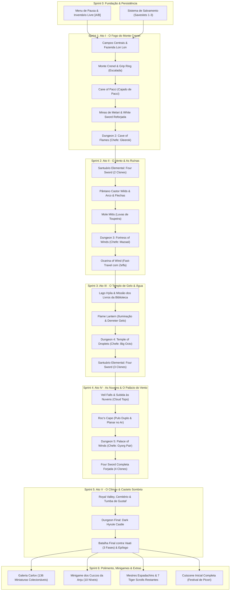

# OpenMinish - Planner de Sequência de Desenvolvimento & Grafo de Dependências
> **Documento Oficial de Engenharia e Roteiro de Implementação**
> **Repositório**: `OpenMinish` (The Legend of Zelda: The Minish Cap Native PC Port)
> **Arquitetura**: C11 Nativo com Hardware Abstraction Layer (HAL) | Zero-ROM Runtime
> **Público-Alvo**: Engenheiros de Software, Contribuidores e Agentes Autônomos de IA (Antigravity/Gemini)

---

## 🧭 1. Grafo de Dependências Globais (Core Dependency Graph)

O desenvolvimento de *The Minish Cap* segue uma estrutura rigorosa de interdependência de itens, habilidades, regiões e masmorras. Nenhum recurso deve ser iniciado sem que suas dependências canônicas estejam 100% implementadas e verificadas.

---

## 📊 2. Status Geral das Fases

| Sprint / Fase | Status | Conclusão | Pré-requisito Obrigatório | Branch Padrão |
| :---: | :---: | :---: | :--- | :--- |
| **Sprint 0: Fundação & Persistência** | **Próximo (A Iniciar)** | 0% | Itens atuais (Bombas, Nadadeiras, Pote, Botas) | `feature/pause-menu-inventory` |
| **Sprint 1: Ato I (Monte Crenel)** | Pendente | 0% | Sprint 0 + Bombas | `feature/mount-crenel` |
| **Sprint 2: Ato II (Fortress of Winds)** | Pendente | 0% | Sprint 1 (Elemento Fogo + White Sword) | `feature/fortress-of-winds` |
| **Sprint 3: Ato III (Temple of Droplets)**| Pendente | 0% | Sprint 2 (Ocarina + Flippers) | `feature/temple-of-droplets` |
| **Sprint 4: Ato IV (Palace of Winds)** | Pendente | 0% | Sprint 3 (3 Elementos + Ocarina) | `feature/palace-of-winds` |
| **Sprint 5: Ato V (Dark Hyrule Castle)** | Pendente | 0% | Sprint 4 (Four Sword Completa) | `feature/dark-hyrule-castle` |
| **Sprint 6: Polimento & Extras** | Pendente | 0% | Sprint 5 (Jogo Base Concluído) | `feature/extras-polish` |

---

## 🛠️ 3. Roteiro Detalhado por Sprint

### Sprint 0: Fundação de Gameplay & Persistência
- **Objetivo**: Permitir gerenciamento de inventário autêntico de Game Boy Advance e salvamento do progresso em disco.
- **Tarefas**:
  1. `feature/pause-menu-inventory`:
     - Menu acionado por `[ENTER]` ou `[START]`.
     - Congelamento total de entidades e física.
     - Grid clássico de inventário com seleção de itens e atribuição aos botões `[A]` e `[B]`.
     - Exibição de contadores (Rupees, Bombas, Chaves, Corações e Kinstones).
  2. `feature/save-load-system`:
     - Gravação atômica em disco de arquivos `save1.dat`, `save2.dat`, `save3.dat`.
     - Salvamento de coordenadas, HP, flags de quests e inventário.
     - Auto-save em transições de cenário.

### Sprint 1: Ato I - O Fogo do Monte Crenel & O 2º Elemento
- **Objetivo**: Expandir o overworld para os campos centrais e escalar o Monte Crenel até a forja de Melari e a Caverna das Chamas.
- **Tarefas**:
  1. `feature/hyrule-field-expansion`: North Hyrule Field, South Hyrule Field, entrada da Fazenda Lon Lon, Moblins e Peahats.
  2. `feature/mount-crenel-grip-ring`: Paredões rochosos verticais, item Grip Ring para escalada, sementes de feijão mágico e fontes termais.
  3. `feature/cane-of-pacci`: Item Cajado de Pacci para energizar buracos no chão (super salto vertical), virar carrinhos e Spiny Beetles.
  4. `feature/melari-mines-white-sword`: Vilarejo subterrâneo dos Minish mineradores e forja da White Sword básica.
  5. `feature/dungeon-cave-of-flames`: Dungeon 2 com trilhos, lava e Chefe Gleerok (virar carapaça e golpear o ponto vulnerável).

### Sprint 2: Ato II - O Vento, As Ruínas & A Four Sword (2 Clones)
- **Objetivo**: Desbloquear os primeiros clones e explorar o pântano e as ruínas antigas.
- **Tarefas**:
  1. `feature/elemental-sanctuary-split2`: Santuário Elemental no pátio do castelo; infusão de Terra e Fogo desbloqueia 2 Clones simultâneos da Four Sword.
  2. `feature/castor-wilds-pegasus-swamp`: Pântano com lodo movediço e obtenção do Arco e Flechas.
  3. `feature/mole-mitts-digging`: Luvas de Toupeira com física de escavação em terra fofa.
  4. `feature/wind-ruins-armos`: Minish entrando dentro de robôs Armos para acionar circuitos internos.
  5. `feature/dungeon-fortress-of-winds`: Dungeon 3 e Chefe Mazaal (cabeça mecânica ancestral). Obtenção da Ocarina of Wind.

### Sprint 3: Ato III - O Templo de Gelo & A Four Sword (3 Clones)
- **Objetivo**: Navegar o grande Lago Hylia, iluminar cavernas com a Lanterna de Fogo e conquistar o Elemento Água.
- **Tarefas**:
  1. `feature/ocarina-fast-travel`: Chamada do pássaro Zeffa para transporte rápido até cristas de vento.
  2. `feature/lake-hylia-library`: Exploração aquática com Flippers, quest dos livros gigantes da biblioteca de Hyrule Town.
  3. `feature/flame-lantern`: Lanterna de Fogo com iluminação dinâmica circular, derretimento de gelo e acendimento de tochas.
  4. `feature/dungeon-temple-of-droplets`: Dungeon 4 congelada com quebra-cabeças de reflexão de luz solar e Chefe Big Octo congelado.
  5. `feature/elemental-sanctuary-split3`: Infusão do 3º Elemento: divisão em 3 Clones triangulares.

### Sprint 4: Ato IV - As Nuvens & A Four Sword Forjada (4 Clones)
- **Objetivo**: Escalar as cachoeiras de Veil Falls, alcançar a Tribo dos Ventos no céu e forjar a lâmina quádrupla.
- **Tarefas**:
  1. `feature/veil-falls-cloud-tops`: Cachoeira sagrada, subida às nuvens e travessia com Gust Jar.
  2. `feature/rocs-cape`: Capa de Roc para pulo livre, flutuação no ar e ataque aéreo Downthrust.
  3. `feature/dungeon-palace-of-winds`: Dungeon 5 sobre as nuvens e Chefe Gyorg Pair (batalha aérea pulando entre arraias gigantes).
  4. `feature/four-sword-forged`: Infusão do 4º Elemento sagrado no Santuário. A Four Sword completa é forjada, permitindo 4 Clones simultâneos e Sword Beams com vida cheia.

### Sprint 5: Ato V - O Clímax & A Derrota de Vaati
- **Objetivo**: Resgatar o reino e derrotar o feiticeiro Vaati em sua fortaleza sombria.
- **Tarefas**:
  1. `feature/royal-valley-graveyard`: Labirinto de névoa, Dampé o coveiro e Tumba do Rei Gustaf.
  2. `feature/dungeon-dark-hyrule-castle`: Castelo corrompido por trevas, quebra-cabeças com 4 Clones e sinos de petrificação.
  3. `feature/boss-vaati-climax`: Confronto final épico em 3 fases contra Vaati (Vaati Reborn, Vaati Transfigured, Vaati's Wrath), cura da Princesa Zelda e créditos finais.

### Sprint 6: Polimento, Minigames, Dojo & Lançamento 1.0
- **Objetivo**: Conteúdo secundário de alta fidelidade e experiência completa 100%.
- **Tarefas**:
  1. `feature/figurine-gallery-gacha`: Galeria do Carlov com 136 miniaturas 3D colecionáveis via Mysterious Shells.
  2. `feature/anju-cucco-minigame`: Minigame das galinhas Cucco de Anju em 10 níveis cronometrados.
  3. `feature/sword-techniques-dojo`: Mestres Espadachins ensinando os 7 Tiger Scrolls restantes.
  4. `feature/title-intro-cutscene`: Abertura com o Torneio de Esgrima, aparição de Vaati e petrificação de Zelda.

---

## 📌 Regras de Execução para Agentes de IA

1. **Consulta Obrigatória**: Todo agente deve ler este documento antes de propor ou iniciar qualquer nova branch de funcionalidade.
2. **Sem Salto de Etapas**: Não implemente itens ou dungeons posteriores sem que a etapa anterior do Sprint esteja commitada e testada no `develop`.
3. **Padrão de Branch**: Cada funcionalidade deve ter sua própria branch no padrão `feature/<nome-descritivo>`, nunca desenvolver diretamente no `develop` ou `main`.
4. **Validação Visual Obrigatória**: Toda entrega deve gerar um script de verificação visual (`scratch/verify_*.py`) gerando um artefato de imagem inspecionado via `view_file` para assegurar fidelidade pixel-perfect antes do merge.
5. **Zero-ROM**: Nunca comitar ROMs ou dumps binários brutos; apenas código-fonte C11 e assets convertidos pelo extrator clean-room.
